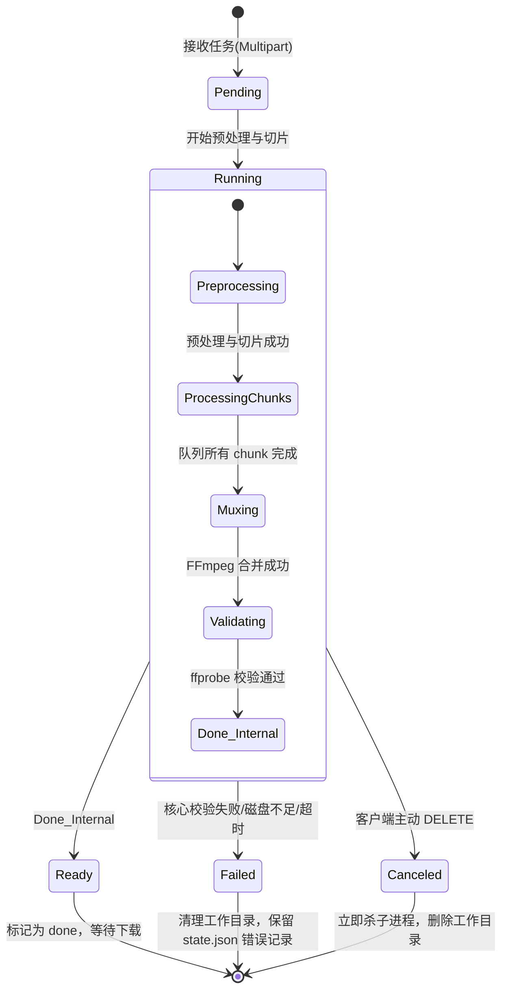

# 技术设计文档 v4：基于 Fastify + Edge-TTS + FFmpeg 的高性能有声书（M4B）生成服务

> **v4 修订说明**（相对 v3）：
>
> 1. **架构模式精简**：明确第一版仅实现**单机模式**，将分布式架构设计（Redis + BullMQ + S3）移至附录 C 作为远期规划。
> 2. **TTS 引擎解耦与接口抽象**：引入 `TTSProvider` 接口契约，API 支持通过 `ttsEngine` 指定引擎（默认 `edge-tts`）。指定选用 Node.js 原生包 `msedge-tts`，消除对 Python 的依赖。
> 3. **并发流水线改造**：由传统的“TTS 全部完成 → 统一转码”的串行模式，改设计为“TTS 与转码流水线并行（事件驱动）”——即单个 chunk 成功生成 MP3 后，立即异步触发其转码任务，利用网络 IO 与 CPU 算力的重叠，最大化吞吐并平滑 CPU 负载。
> 4. **输入文本编码检测与预处理**：引入 `jschardet` / `iconv-lite` 进行文件编码检测并统一转为 UTF-8；新增文本预处理步骤，支持繁简转换（简体优先）、空白/换行符标准化、特殊 Unicode 字符过滤、广告去噪。
> 5. **章节与 TTS 块严格对齐**：改变以往可能跨章节切割的逻辑，设计为“章节边界作为强制切割点”。章节内部再根据 `chunkSize` 切分，彻底消除章节时长在 chunk 间的近似分摊误差，使章节时间戳达到 100% 精确。
> 6. **字数统计口径明确**：明确定义“字数/字符数”为过滤掉空白字符（空格、换行、制表符）后的 Unicode Code Point 数量。
> 7. **文件上传与封面支持**：API 调整为 `multipart/form-data` 上传，支持客户端直接上传文本文件与可选的封面图片。若提供封面，合并时利用 FFmpeg 写入 `covr` 元数据（M4B 封面），避免 Apple Books 显示灰色占位图。
> 8. **子进程超时与优雅关闭**：为 FFmpeg、ffprobe 子进程引入超时机制（转码 60s，合并 120s）。实现 `SIGTERM` 优雅关闭：拒绝新任务、等待当前进行中的 chunks 写入 state.json 检查点、终止子进程、优雅退出。
> 9. **统一配置管理**：新增第 5 节“配置项参考表”，明确定义系统所有环境变量及默认值范围。
> 10. **输出校验机制**：在任务标记为 `done` 前，增加 `ffprobe` 输出校验，确认 MP4 容器结构完整性、章节数一致性以及 `ftyp/moov` 的头部前置顺序。
> 11. **测试策略聚焦**：制定明确的单元测试策略，覆盖切片正则、字符统计、配额计算等核心算法。

---

## 1. 概述（Overview）

### 1.1 背景与痛点

随着网文有声书需求的增长，将大体积文本（如 2MB 纯文本小说，约 90 万字）高效转化为高质量音频成为一个常见的技术挑战。传统的云端 TTS 商业 API 按字数计费，跑完一本大篇幅小说成本高昂；而利用微软 Edge 浏览器的大声朗读接口（Edge-TTS）虽然可以零成本调用，但在面对长文本时存在单次请求字数限制（建议单块 2,500 字内）和高并发触发 HTTP 429 / IP 封禁的风险。

此外，在后端处理大量音频碎片拼接时，若采用全量重编码（Re-encode）方案，会消耗大量 CPU 算力并阻塞 Node.js 事件循环，降低并发吞吐。

### 1.2 设计目标

* **极致性能（最终合并零重编码）**：在最终合并阶段，采用 FFmpeg concat demuxer + Stream Copy（`-c copy`）的无损 Remuxing，直接复制音频流，将最终合并阶段的 CPU 消耗降至最低（毫秒到秒级）。注：由于 Edge-TTS 等引擎不直接输出 AAC，**每个片段需要一次轻量的 MP3→AAC 转码**作为前置标准化（per-chunk、流水线并发），此步无法省略，但开销远低于一次性整体重编码。
* **异步任务、不阻塞 HTTP 连接**：长任务（90 万字约 20–40 分钟）通过任务 ID + 状态查询 + 文件下载三段式 API 解耦，避免反向代理超时。
* **流水线并行化**：TTS 合成与 FFmpeg 转码并行化。一旦单个块的 TTS 完成，无需等待其他块，立即进入转码阶段。
* **内存与 I/O 友好**：采用 `multipart/form-data` 流式写入临时文件做切片，避免大文本常驻堆内存；最终合并文件落盘后通过 `fs.createReadStream` 流式推送下载。
* **苹果生态完美适配**：输出 `.m4b`，支持嵌入封面图片，写入 `moov` 元数据索引块并通过 `-movflags +faststart` 前置，写入标准 FFmetadata 章节列表，完美适配 Apple Books 的封面展示、断点记忆、锁屏快进、原生章节目录功能。
* **可恢复性**：单机模式下基于 `state.json` 检查点实现断点续传，服务重启后可跳过已完成 chunk。

---

## 2. 系统架构与核心流程（Architecture & Data Flow）

整个系统生命周期分为五个核心阶段：**文本上传与预处理 → 文本智能切片 → 流水线异步调度（TTS+转码） → 容器无损合并与校验 → 流式下载与优雅清理**。

### 2.1 架构拓扑

```
[ 客户端 ]
   │
   │  ① POST /jobs  (multipart/form-data: text file, cover image, params)
   ▼
[ Fastify API 网关 ] ──► 立即返回 { jobId, status: "pending" }
   │
   │  ② 流入暂存磁盘，触发异步任务处理
   ▼
┌────────────────── Worker（单机同进程异步工作流） ──────────────────┐
│                                                                    │
│   [文本预处理] ──► 编码检测(UTF-8化) ──► 繁简转换与降噪            │
│       │                                                            │
│   [文本智能切片]                                                   │
│       ├─► 章节切片（用于元数据目录，四重校验判定）                 │
│       └─► TTS 块切片（强制与章节对齐，每块 ≤ 2500 字）             │
│                                                                    │
│   [流水线调度器] ─── (事件驱动/双并发池) ───────────────────────┐  │
│       │                                                         │  │
│       ├─► [TTS 任务池 (并发=2)] ──► msedge-tts ──► raw_N.mp3    │  │
│       │                                          │              │  │
│       │                                     (TTS 完成)          │  │
│       │                                          ▼              │  │
│       └─► [转码任务池 (并发=CPU-1)] ◄────────────┘              │  │
│                 │                                                  │
│                 ▼                                                  │
│             FFmpeg (MP3 -> AAC 24kHz Mono 64k)                     │
│                 │                                                  │
│                 ▼                                                  │
│             chunk_N.m4a + ffprobe 精确时长 ──► 写入 state.json     │
│                                                                    │
│   [FFmpeg 最终合并] ──► concat demuxer + 封面嵌入 + chapters.ffmeta │
│       │                                                            │
│   [输出校验 (ffprobe)] ──► 校验容器、章节数及 moov 头部位置         │
│       ▼                                                            │
│   output.m4b（准备完毕，状态置为 done）                            │
└────────────────────────────────────────────────────────────────────┘
   │
   │  ③ GET /jobs/:id  ──► 返回 { status, progress, downloadUrl }
   │  ④ GET /jobs/:id/file  ──► 流式读取 output.m4b
   │  ⑤ 响应完成/超时未下载 ──► 异步删除工作目录
   ▼
[ 客户端 ]
```

---

## 3. 核心模块详细设计（Component Detail）

### 3.1 文本预处理与智能切片模块

#### 3.1.1 文本编码检测与预处理
1. **编码检测与转换**：由于用户上传的文本可能是 GBK、GB18030 等格式，服务接收到文件流后，读取头部样本数据使用 `jschardet` 进行编码研判。若非 UTF-8，使用 `iconv-lite` 将其流式转码为标准 UTF-8 字符串存入工作目录。
2. **文本清洗**：
   - 过滤 HTML 标签、SSML 标记（如 `<voice>`），防范 SSML 注入风险。
   - 换行符标准化：将所有 `\r\n` 统一转换为 `\n`。
   - 空行压缩：将连续 3 个及以上的 `\n` 压缩为双换行 `\n\n`，去除行首尾的无意义全角/半角空格。
   - 繁简转换：利用简易字典或快速转换库，将繁体字统一转换为简体字，确保 TTS 引擎多音字发音准确。

#### 3.1.2 章节切片（用于章节元数据）
* 用途：构造 M4B 的 `chapters.ffmeta` 结构。
* 基础正则：
  ```js
  /^\s*(?:序章|楔子|引子|尾声|后记|番外(?:篇)?|第\s*[一二三四五六七八九十百千万零\d]+\s*(?:章|回|卷|集|节|篇|部))(?:[\s\u3000]+\S[^\n]{0,40})?\s*$/m
  ```
* **四重后置校验**（过滤正文中的误匹配）：
  1. **行字数上限**：候选行整行长度 ≤ 40 字符（排除换行）。
  2. **前后空行边界**：候选行的上一非空行和下一非空行之间，候选行必须是一个独立的物理段落（上下文存在空行 `\n\n` 或为文件首尾）。
  3. **序号严格单调递增**：提取候选章节中的中文/阿拉伯数字，转换为数值，跨全书必须严格单调递增（允许个别空缺，不允许倒退或异常跳跃）。
  4. **总数合理性**：根据全文字数，检查匹配出的章节总数。若全文字数 / 章节数不在合理区间（如 1000 字 ~ 50000 字/章），则触发兜底。
* **兜底逻辑**：若校验后剩余章节数 < 3，则视为无章节结构，按“每 1.5 万字”强制划分虚拟章节（命名为“第 1 部分”、“第 2 部分”……）。

#### 3.1.3 TTS 请求块切片（与章节严格对齐）
为了彻底消除章节时长在 chunks 间的近似分摊误差，**章节边界被作为强制的 TTS 块切割点**。

**切片算法流程**：
1. 系统根据章节切片结果，将文本分割为一个个独立的章节文本块。
2. 对每个章节文本块，如果其字数（定义见 3.1.4）超过 `chunkSize`（默认 2500 字，可配范围 1000~5000），则在章节内部进行细分切割：
   - 从当前章节文本的起始位置向后截取 `chunkSize` 字符作为窗口。
   - 在窗口尾部 200 字范围内，从后向前寻找句子边界符号进行回退切分。优先级为：`\n\n` > `\n` > `。` > `！` > `？` > `；` > `，`。
   - 若在 200 字回退范围内未找到任何上述符号，则硬性在 `chunkSize` 边界处切开。
3. 如果章节文本块字数 ≤ `chunkSize`，则它本身作为一个独立的 TTS 请求块。
4. 这种方式下，**每一个 chunk 必归属于且仅归属于一个特定的章节**。章节的精确持续时间等于其名下所有 chunks 实际音频时长的累加值：
   $$\text{Duration}(\text{Chapter}_i) = \sum_{j \in \text{Chunks}(\text{Chapter}_i)} \text{Duration}(\text{Chunk}_j)$$

#### 3.1.4 字数定义
* 系统中所有的“字数/字符数”统计口径统一为：**排除所有空白字符（空格、换行、制表符）后的 Unicode Code Point 数量**。
* JavaScript 实现参考：
  ```js
  function getCleanCharCount(text) {
    return [...text].filter(char => !/\s/.test(char)).length;
  }
  ```

---

## 3.2 TTS 引擎抽象与 Provider 契约

为了防范 Edge-TTS 接口变更风险并支持多引擎扩展，设计定义了统一的 `TTSProvider` 接口契约。

### 3.2.1 Provider 接口定义
```typescript
interface TTSOptions {
  voice: string;
  rate: string;      // 例如 "+0%" 或 "1.0"
  pitch: string;     // 例如 "+0Hz"
  bitrate: string;   // 例如 "64k"
}

interface TTSResult {
  audioPath: string; // 本地暂存原始音频的绝对路径
  format: string;    // 输出音频的格式扩展名，例如 "mp3"、"webm" 等
}

interface TTSProvider {
  /**
   * 将给定文本合成音频文件
   * @param text 待合成的文本片段
   * @param options TTS 音频参数
   * @param outPath 指定输出的临时文件路径（不含后缀，由 Provider 自行补齐）
   */
  synthesize(text: string, options: TTSOptions, outPath: string): Promise<TTSResult>;
}
```

### 3.2.2 msedge-tts 默认实现
* **客户端库**：选用 Node.js 原生的 `msedge-tts` npm 包。该包基于官方 Edge WebSocket 协议，无需 Python 环境。
* **参数映射**：
  - `voice` 校验：必须在合法 voice 列表中（如 `zh-CN-YunxiNeural`）。
  - `rate` / `pitch` 校验：必须匹配正则 `^[+-]\d+%$` 或 `^[+-]\d+Hz$`，超出限制则截断。
  - 请求音频格式格式参数：`audio-24khz-48kbitrate-mono-mp3`。
* **输出**：生成原始 `raw_<n>.mp3` 文件。

---

## 3.3 片段标准化模块（Per-Chunk Transcoder）

无论 TTS 引擎输出何种格式（如 MP3、WebM 或 OGG），片段标准化模块都会将其统一转码为参数完全一致的 AAC/M4A 容器片段，以便后续执行 `-c copy` 合并。

每个 chunk 启动一个独立的 FFmpeg 进程进行标准化转码。命令参数如下：
```bash
ffmpeg -hide_banner -loglevel error -y \
  -i /tmp/job_<id>/raw_<n>.[ext] \
  -c:a aac -profile:a aac_low \
  -b:a 64k -ar 24000 -ac 1 \
  -movflags +faststart \
  /tmp/job_<id>/chunk_<n>.m4a
```

转码完成后，利用 `ffprobe` 获取该 M4A 片段的毫秒级精确时长：
```bash
ffprobe -v error -show_entries format=duration -of default=noprint_wrappers=1:nokey=1 /tmp/job_<id>/chunk_<n>.m4a
```
获取的时长（Duration）立即写入内存状态，并原子写入 `state.json`。

---

## 3.4 FFmpeg 最终合并与封面嵌入

#### 3.4.1 生成 `filelist.txt` 与 `chapters.ffmeta`
* `filelist.txt` 格式（对路径中的单引号进行转义）：
  ```
  file '/tmp/job_<id>/chunk_001.m4a'
  file '/tmp/job_<id>/chunk_002.m4a'
  ```
* `chapters.ffmeta` 结构包含元数据和各章节精确的起始毫秒时间戳（通过 chunks 时长精确累加，不再按字符比例分摊）。

#### 3.4.2 最终合并与封面注入命令
如果客户端在上传时提供了封面图片 `cover.jpg`（或 `cover.png`），FFmpeg 最终合并命令需要将图像作为视频流写入 `covr` atom 中（Attached Picture 模式）：

```bash
ffmpeg -hide_banner -loglevel error -y \
  -f concat -safe 0 -i /tmp/job_<id>/filelist.txt \
  -i /tmp/job_<id>/chapters.ffmeta \
  -i /tmp/job_<id>/cover.jpg \
  -map 0:a -map_metadata 1 -map 2:v \
  -disposition:v:0 attached_pic \
  -c:a copy -c:v copy \
  -movflags +faststart \
  -f mp4 \
  /tmp/job_<id>/output.m4b
```

若**无封面**，则省略第三个输入及视频映射参数：
```bash
ffmpeg -hide_banner -loglevel error -y \
  -f concat -safe 0 -i /tmp/job_<id>/filelist.txt \
  -i /tmp/job_<id>/chapters.ffmeta \
  -map 0:a -map_metadata 1 \
  -c copy \
  -movflags +faststart \
  -f mp4 \
  /tmp/job_<id>/output.m4b
```

---

## 3.5 流水线并行化调度设计

系统采用基于事件/队列的并发流水线模型，使 **TTS 请求** 与 **FFmpeg 标准化转码** 异步并行。

### 3.5.1 流水线双并发池
1. **TTS 并发池**（默认大小 = 2）：控制向微软/三方 TTS 接口发起 WebSocket 请求的并发数，防止被封禁。
2. **转码并发池**（默认大小 = CPU核心数 - 1）：控制本地 FFmpeg 转码子进程的并发数，防止 CPU 爆满。

```
[文本切片 chunks 队列]
      │
      ▼
┌──────────────┐      (成功)      ┌──────────────────┐
│  TTS 并发池  ├───────────────► │ 转码任务待处理队列 │
│  (Limit = 2) │                 └────────┬─────────┘
└──────────────┘                          │
                                          ▼
                                 ┌─────────────────┐
                                 │   转码并发池    │
                                 │ (Limit = CPU-1) │
                                 └────────┬────────┘
                                          │ (完成)
                                          ▼
                                   [写 state.json]
```

### 3.5.2 运行机制
- 任务启动时，首先将所有切好的文本 chunks 放入 TTS 队列。
- 当任一 chunk 的 TTS 合成成功落盘（例如生成 `raw_001.mp3`），触发完成事件，将该 chunk 的标准化转码任务（MP3 -> M4A）推入转码池。
- TTS 调度器在完成当前 chunk 并等待随机延迟（1000~2500ms）后，继续处理下一个 TTS 任务。
- 转码池中的任务调度完全独立，转码完成后读取时长，更新 `state.json`。
- 当最后一个 chunk 的转码任务完成，触发 `Mux` 阶段，生成最终的 `output.m4b`。

---

## 4. API 接口规范（API Specifications）

API 统一使用 `multipart/form-data` 格式，支持文件流式写入，规避大 JSON 带来的内存峰值风险。

### 4.1 创建任务

* **请求**：`POST /api/v1/audiobook/jobs`
* **Content-Type**：`multipart/form-data`
* **参数表**：

| 参数名 | 类型 | 必选 | 说明 |
| :--- | :--- | :--- | :--- |
| `text` | File | 是 | 有声书文本文件（.txt），支持自动检测 GBK/UTF-8 编码 |
| `cover` | File | 否 | 封面图片（.jpg / .png），建议分辨率 1:1，大小不超过 2MB |
| `title` | String | 是 | 书名，写入元数据标题 |
| `author` | String | 否 | 作者，写入元数据 Artist |
| `ttsEngine`| String | 否 | TTS 引擎类型，可选 `"edge-tts"`，默认 `"edge-tts"` |
| `voice` | String | 否 | 发音人，默认 `"zh-CN-YunxiNeural"` |
| `rate` | String | 否 | 语速，如 `+0%`，默认 `+0%` |
| `pitch` | String | 否 | 音高，如 `+0Hz`，默认 `+0Hz` |
| `bitrate` | String | 否 | 目标音频码率，可选 `"32k" | "64k" | "128k"`，默认 `"64k"` |

* **响应**：`201 Created`
  ```json
  {
    "jobId": "8a1f0c9e-2c1a-4f8a-b5d7-6e3a9c5e2f10",
    "statusUrl": "/api/v1/audiobook/jobs/8a1f0c9e-2c1a-4f8a-b5d7-6e3a9c5e2f10",
    "status": "pending"
  }
  ```

### 4.2 查询任务状态

* **请求**：`GET /api/v1/audiobook/jobs/:jobId`
* **响应**：
  ```json
  {
    "jobId": "8a1f0c9e-2c1a-4f8a-b5d7-6e3a9c5e2f10",
    "status": "running", // pending | running | done | failed | canceled
    "progress": {
      "phase": "tts", // preprocess | tts | mux | validating | ready
      "ttsChunks": { "done": 45, "total": 113 },
      "transcodeChunks": { "done": 30, "total": 113 }
    },
    "downloadUrl": null, // status 为 done 时返回 "/api/v1/audiobook/jobs/8a1f0c9e-2c1a-4f8a-b5d7-6e3a9c5e2f10/file"
    "error": null,
    "startedAt": "2026-05-25T07:11:23Z",
    "finishedAt": null
  }
  ```

### 4.3 流式下载

* **请求**：`GET /api/v1/audiobook/jobs/:jobId/file`
* **响应头**：
  ```
  HTTP/1.1 200 OK
  Content-Type: audio/mp4
  Content-Disposition: attachment; filename="title.m4b"
  Content-Length: 234567890
  Accept-Ranges: bytes
  ```
* 响应成功结束（`close` 事件）后，触发后台异步垃圾清理。

### 4.4 取消任务

* **请求**：`DELETE /api/v1/audiobook/jobs/:jobId`
* **响应**：`204 No Content`
* 业务逻辑：向任务工作流发出取消信号，终止正在运行的子进程，清理工作目录。

---

## 5. 系统细节与弹性设计（System Details & Resilience）

### 5.1 配置参考表

应用通过读取环境变量（支持 `.env`）进行参数配置。

| 环境变量名 | 默认值 | 允许范围 / 格式 | 说明 |
| :--- | :--- | :--- | :--- |
| `PORT` | `3000` | `1 ~ 65535` | 服务监听端口 |
| `HOST` | `127.0.0.1` | IP 或域名 | 服务监听 Host |
| `TMP_ROOT` | `/tmp/audiobook` | 有效写权限路径 | 临时工作根目录，可挂载为 `/dev/shm` |
| `MAX_TEXT_SIZE_MB` | `5` | `1 ~ 50` | 允许上传的文本最大限制（单位 MB） |
| `CONCURRENT_TTS_LIMIT` | `2` | `1 ~ 5` | TTS 并发请求上限（保护风控） |
| `CONCURRENT_TRANSCODE_LIMIT` | `CPU - 1` | `1 ~ 32` | FFmpeg 标准化并发数 |
| `DEFAULT_TTS_ENGINE` | `edge-tts` | `edge-tts` (可扩展) | 默认 TTS 引擎 |
| `SUBPROCESS_TIMEOUT_MS` | `60000` | `5000 ~ 300000` | 单个 FFmpeg/ffprobe 子进程超时时间 |
| `GLOBAL_TASK_TIMEOUT_MS` | `3600000` | `600000 ~ 86400000` | 单个有声书任务全局最大允许运行时间 |

---

### 5.2 状态机与错误处理

#### 5.2.1 任务状态转移图



#### 5.2.2 错误分类及处理策略
1. **暂时性错误（Transient Error）**：
   - *类型*：TTS 网络请求抖动、HTTP 502/503、微软 WebSocket 1006 关闭。
   - *策略*：指数退避重试（最多 3 次）。若遇到 HTTP 429 风控，转入 30 秒冷却锁，挂起 TTS 并发队列。
2. **灾难性错误（Fatal Error）**：
   - *类型*：磁盘空间不足（507）、文本切片校验后无有效章节、FFmpeg 最终合并崩溃。
   - *策略*：终止整个任务，状态置为 `failed`，释放所有锁，回写错误详情到 `state.json`。
3. **部分失败策略（Partial Failure）**：
   - 对单个 chunk 的合成与转码，最大重试次数为 3 次。若某个 chunk 彻底失败，为了保证有声书内容的完整性，**采取 0 容忍策略**，直接将整个任务状态置为 `failed`，不生成残缺的有声书。

---

### 5.3 子进程超时与优雅关闭

#### 5.3.1 子进程超时守护
在启动 FFmpeg/ffprobe 子进程时，包装 `Promise` 并引入超时定时器：
```javascript
const child = spawn('ffmpeg', args);
const timer = setTimeout(() => {
  child.kill('SIGKILL'); // 强制杀死防止僵尸进程
}, process.env.SUBPROCESS_TIMEOUT_MS);
```

#### 5.3.2 优雅关闭（Graceful Shutdown）
系统监听进程的 `SIGTERM` / `SIGINT` 信号：
1. **拒绝新任务**：Fastify 网关停止接收新的 `/jobs` 请求，健康检查 `/healthz` 返回 `503`。
2. **保存检查点**：对于运行中的任务，允许当前正在执行的 TTS chunk 完成（最大等待 15s），并将已转码成功的 chunk 列表安全地写入各任务目录下的 `state.json` 中。
3. **强制收尾**：向所有运行中的 FFmpeg 进程发送 `SIGKILL`，确保不留死锁或挂起进程。
4. **退出进程**：释放所有文件句柄后 `process.exit(0)`。后续服务重启时，通过扫描 `TMP_ROOT` 重读 `state.json` 实现断点续传。

---

### 5.4 输出校验

在合并完成后，任务不应立刻置为 `done`，必须通过输出校验模块：
1. **容器可用性校验**：
   ```bash
   ffprobe -v error -show_format /tmp/job_<id>/output.m4b
   ```
   检查退出码为 0，确保 MP4/M4B 封装无损。
2. **章节完整性校验**：
   读取输出文件的章节总数，确保其与 `state.json` 中计算的章节总数严格一致。
3. **faststart(moov前置) 校验**：
   读取文件前 100KB 数据，判断 `ftyp` 和 `moov` 原子（Atom）是否存在于头部，确保客户端能实现即时播放与 Seeking。

---

## 6. 已知问题与设计取舍（Known Issues）

### 6.1 AAC 拼接处的 priming samples / encoder delay
* **描述**：每个独立 chunk 转 AAC 时，编码器会产生约 44ms 的“暖机数据”。在 `-c copy` 合并后，简易播放器上可能在边界处产生轻微咔哒声。
* **取舍**：不采取 `afade` 重编码方案。现代播放器（如 Apple Books）可利用 M4A 的 edit list (`elst`) 实现完全的 Gapless Playback。为保最终合并的“零重编码”极致性能，此问题在架构上不予处理。

### 6.2 虚拟章节的物理误差
* **描述**：对于没有章节结构的小说，按每 1.5 万字强行切分虚拟章节，其分界点处并非天然停顿，可能在句子中途跳转。
* **取舍**：这是无章节文本的必然折中，强行寻找标点再切割会使得逻辑复杂化，故直接硬性按字数划分。

---

## 7. 测试策略（单元测试）

项目使用测试框架对核心的无状态算法进行严格的单元测试：
1. **文本预处理测试**：
   - 验证繁简转换映射的正确性。
   - 验证 SSML/HTML 标签剥离，防止注入。
2. **章节匹配正则测试**：
   - 构造各种奇特章节名（如带有特殊标点、空格、数字的章节标题）进行识别率测试。
   - 编写“非章节正文”（如含有“第一章说明”但未换行的正文）测试，验证四重后置校验的过滤成功率。
3. **配额估算与字数统计测试**：
   - 测试包含 emoji、中英文混合、多空格文本的 Clean Word Count，确保计算结果与 Unicode 规范对齐。

---

## 附录 A：v1 → v2 变更摘要
*(保留，见 v3 归档)*

## 附录 B：v2 → v3 变更摘要
*(保留，见 v3 归档)*

## 附录 C：未来分布式架构扩展路线（原 5.3 节上浮）

当单机性能遇到瓶颈，系统可通过引入消息队列和共享存储水平扩展：
1. **状态持久化介质上浮**：将 `state.json` 的单机磁盘存储改为 Redis Hash，使用 Redis Set/Bitmap 维护 `ttsCompleted` 和 `transcodeCompleted` 进度。任务调度交由 **BullMQ** 管理。
2. **块存储分布式化**：将本地的临时的 chunks 分片实时上传至 S3 兼容的对象存储（如 AWS S3, MinIO, Cloudflare R2）。
3. **最终合并阶段的局域化**：由于最终合并（FFmpeg concat）必须在单机上利用本地磁盘进行，因此当所有 chunks 生产完毕，由 BullMQ 指派一名特定的 Merge Worker 下载所有 m4a 分片到本地，合并并上传 `.m4b` 至 S3 后清除本地临时文件。
